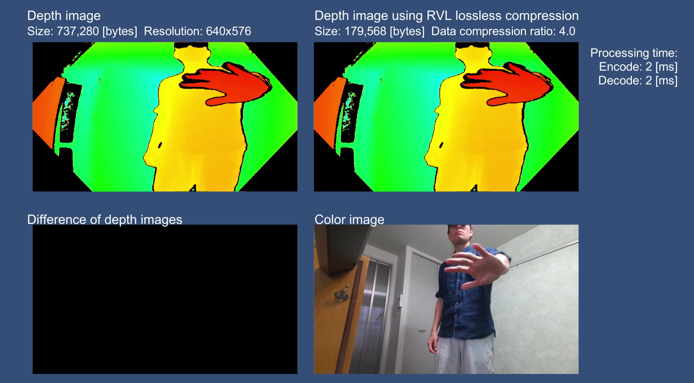

# Depth Stream Compression

[Watch on Youtube](https://youtu.be/o9vBtWslNUw)

RVL

Temporal RVL

## License
- RVL.cs is licensed under the MIT License.  
  Copyright (c) 2017 Andrew D. Wilson  
  Copyright (c) 2020 Soichiro Sugimoto  

- TemporalRVL.cs is licensed under the MIT License.  
  Copyright (c) 2020 Hanseul Jun  
  Copyright (c) 2020 Soichiro Sugimoto  

- Examplesに含まれるアセットはCC0でライセンスされています。  
  The assets included in Examples are licensed under CC0.  
  http://creativecommons.org/publicdomain/zero/1.0/deed.ja  
  https://creativecommons.org/publicdomain/zero/1.0/deed.en  

- このプロジェクトは、上記のアセットを除き、MIT Licenseでライセンスされています。  
  This project is licensed under the MIT License excluding the assets listed above.

## References
A. D. Wilson. (2017). Fast Lossless Depth Image Compression. 
- https://www.microsoft.com/en-us/research/uploads/prod/2018/09/p100-wilson.pdf
- https://dl.acm.org/doi/10.1145/3132272.3134144
- https://www.youtube.com/watch?v=WYU2upBs2hA
- https://www.youtube.com/watch?v=DhT8NFzbGrY

H. Jun and J. Bailenson. (2020). Temporal RVL: A Depth Stream Compression Method. 
- https://vhil.stanford.edu/mm/2020/02/jun-vr-temporal.pdf
- https://github.com/hanseuljun/temporal-rvl
- https://www.youtube.com/watch?v=3qb-oNPf4Es
