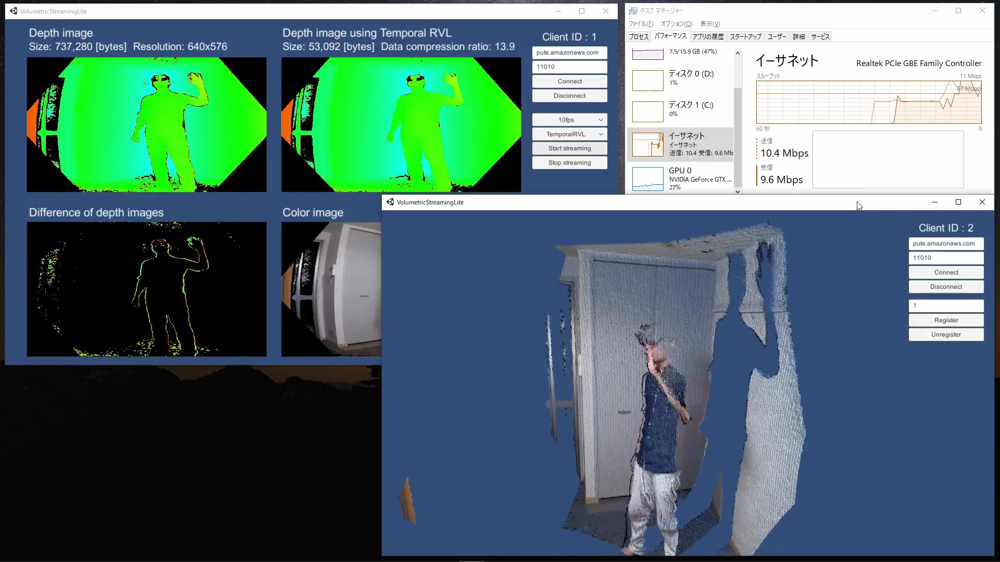

# Volumetric Streaming Lite
Real-time Volumetric Video Streaming Implementation using Unity and LiteNetLib (Reliable UDP Library).

[Watch on Youtube](https://youtu.be/61R0lydO-N4)

## Tested environment
### Client
- Unity 2018.4.21f1
- Azure Kinect SDK 1.4.0
- Windows 10
### Server
- Windows 10 (Local server)
- Amazon Linux (Amazon GameLift)

## Third party assets
このプロジェクトには、以下のアセットが含まれています。  
The following assets are included in this project.

- [AzureKinect4Unity](https://github.com/sotanmochi/AzureKinect4Unity)
  Licensed under the MIT License. Copyright (c) 2020 Soichiro Sugimoto.

- [DepthStreamCompression](https://github.com/sotanmochi/DepthStreamCompression)  
  Licensed under the MIT License. Copyright (c) 2020 Soichiro Sugimoto.

- Microsoft Azure Kinect Sensor SDK  
  Microsoft Azure Kinect Sensor SDK files (the .dll files contained in the Assets/Plugins/AzureKinectSDK.1.4.0 directory) are distributed under the Microsoft Software License Terms.  

  Please see the following license page for complete terms.  
  https://www.nuget.org/packages/Microsoft.Azure.Kinect.Sensor/1.4.0/License

- System.Buffers.4.4.0  
  Licensed under the MIT License. Copyright (c) .NET Foundation and Contributors.

- System.Memory.4.5.3  
  Licensed under the MIT License. Copyright (c) .NET Foundation and Contributors.

- System.Numerics.Vectors.4.5.0  
  Licensed under the MIT License. Copyright (c) .NET Foundation and Contributors.

- System.Runtime.CompilerServices.Unsafe.4.5.2  
  Licensed under the MIT License. Copyright (c) .NET Foundation and Contributors.  

- [LiteNetLib 0.8.3](https://github.com/RevenantX/LiteNetLib/releases/tag/v0.8.3)  
  Licensed under the MIT License. Copyright (c) Ruslan Pyrch.

- [Amazon GameLift CSharp Server SDK Version 3.4.0](https://s3-us-west-2.amazonaws.com/gamelift-release/GameLift_09_03_2019.zip)  
  Licensed under the Apache License 2.0. Copyright (c) Amazon.com, Inc. or its affiliates.  
  This product includes software developed by Amazon Technologies, Inc (http://www.amazon.com/).

## License
このプロジェクトは、サードパーティのアセットを除き、MIT Licenseでライセンスされています。  
This project is licensed under the MIT License, excluding third party assets.
